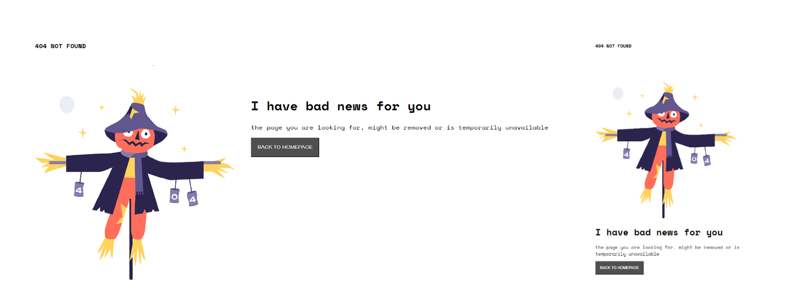

#Make It Real - 404 Page Not Found
##This is a solution to the *html1* project of the Make It Real course.

##The challenge
Make a responsive 404 not found page

##Screenshot

##My process
###Built with
-Semantic HTML5 markup using vscode editor
-CSS properties in a stylesheet file
-I use Flexbox property
-For a responsive design i used media query property
-Also i used space mono font

##What I learned
I learn and practice some of html and css to create a responsive page

##Author
Juan Daviod Peña
github - @juandape
email - juandavidp76@hotmail.com

##Acknowledgments
Thanks to Make it Real to show me a path to become a better programmer

